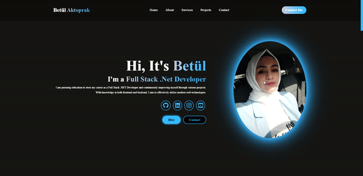

## Portfolio Website

This project is a personal portfolio website I created using HTML and CSS. The site is designed as a single-page layout that includes sections for about me, skills, projects, and contact information.

Bu proje, HTML ve CSS kullanarak oluşturduğum kişisel portföy web sitesidir. Bu site, tek sayfa içerisinde hakkımda, yetenekler, projeler ve iletişim bilgilerinin olduğu bir düzen içerisindedir.

### Technologies Used
 - HTML5: Used for the structural framework and content organization.
 - CSS: Used for visual design, styling, and page layout.
 - Responsive Design: Media queries were utilized to ensure the website works seamlessly across different devices.

### Kullanılan Teknolojiler
 - HTML5: Yapısal iskelet ve içerik düzeni için kullanıldı.
 - CSS: Görsel tasarım, stil ve sayfa düzeni için kullanıldı.
 - Responsive Tasarım: Web sitesinin farklı cihazlarda sorunsuz çalışması için medya sorguları kullanıldı.

### Proje Tanıtımı (Project Demo) (GIF)  

 

https://betulaktoprak.github.io/PortfolioWebsite.HTML.CSS/

