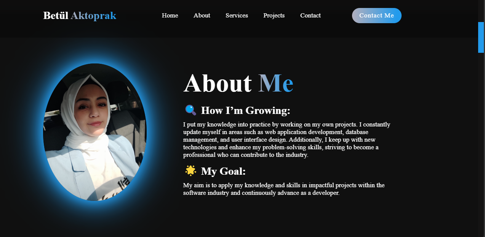
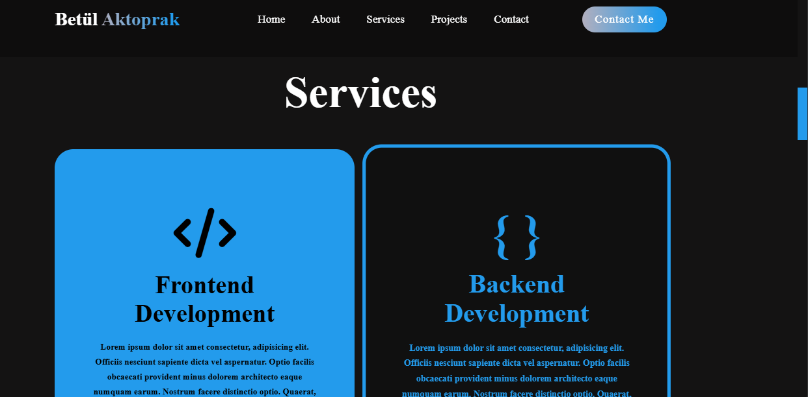
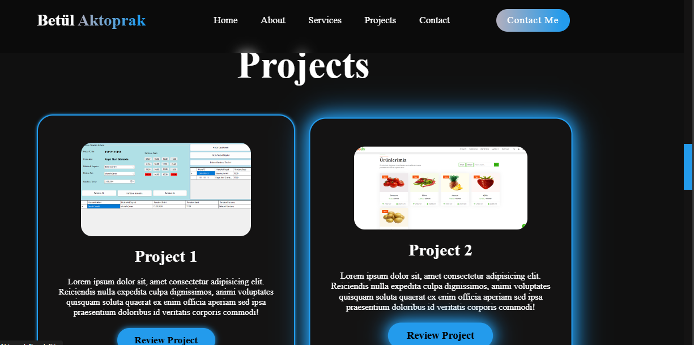
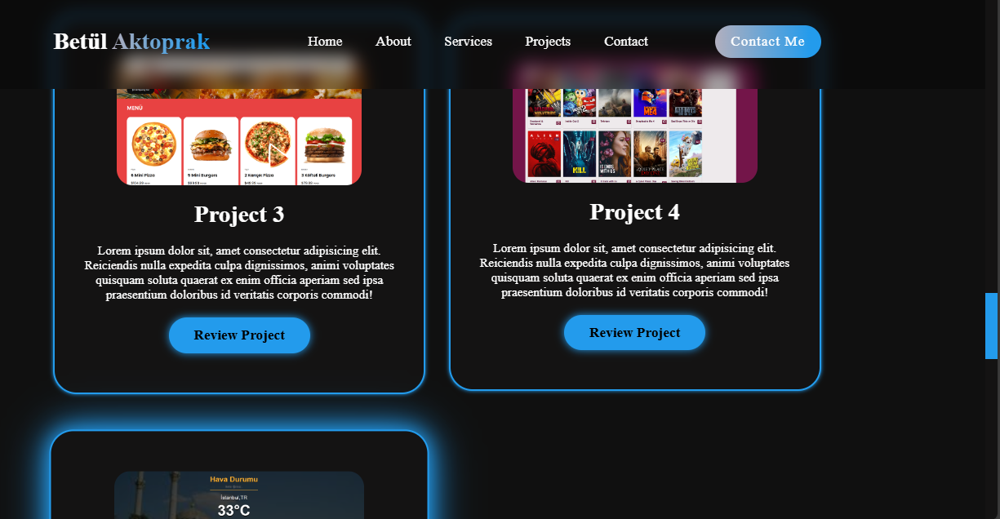

## Portfolio Website

This project is my personal portfolio website, created using HTML and CSS. The site showcases my design skills, projects, and information about me, presented across multiple pages.

Bu proje, HTML ve CSS kullanarak oluşturduğum kişisel portföy web sitesidir. Bu site, tasarım yeteneklerimi, projelerimi ve hakkımda bilgileri içeren bir dizi sayfadan oluşmaktadır.

### Technologies Used
 - HTML5: Used for the structural framework and content organization.
 - CSS: Used for visual design, styling, and page layout.
 - Responsive Design: Media queries were utilized to ensure the website works seamlessly across different devices.

### Kullanılan Teknolojiler
 - HTML5: Yapısal iskelet ve içerik düzeni için kullanıldı.
 - CSS: Görsel tasarım, stil ve sayfa düzeni için kullanıldı.
 - Responsive Tasarım: Web sitesinin farklı cihazlarda sorunsuz çalışması için medya sorguları kullanıldı.

### Ekran Görüntüleri (Screenshots)
Proje sayfasından bazı ekran görüntüleri:

